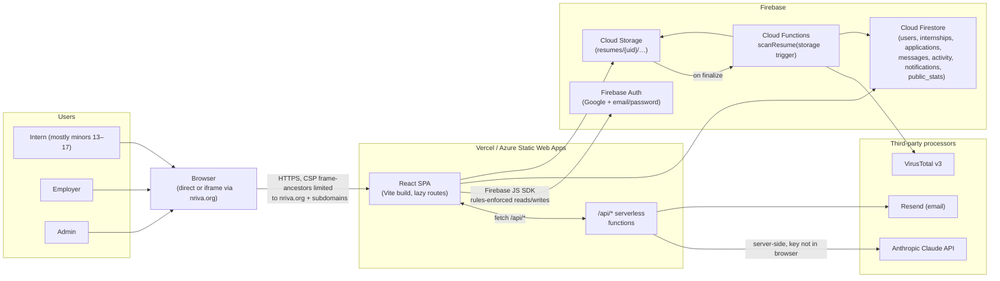
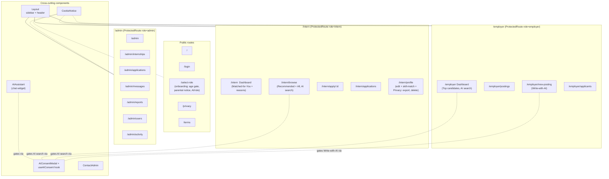
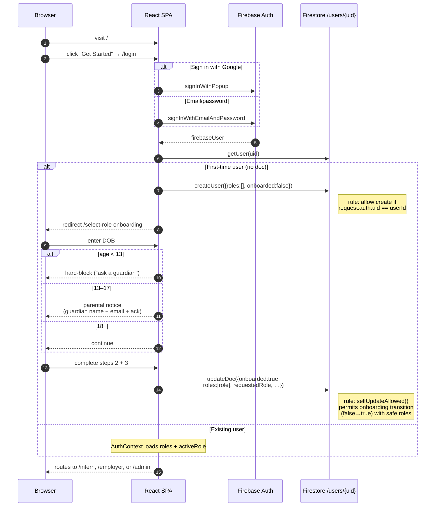
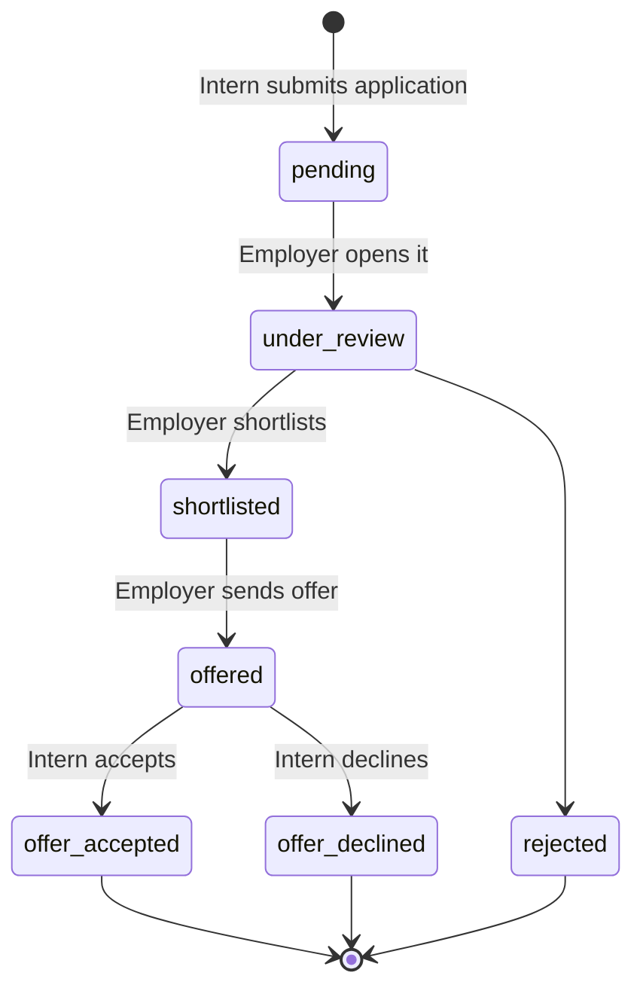
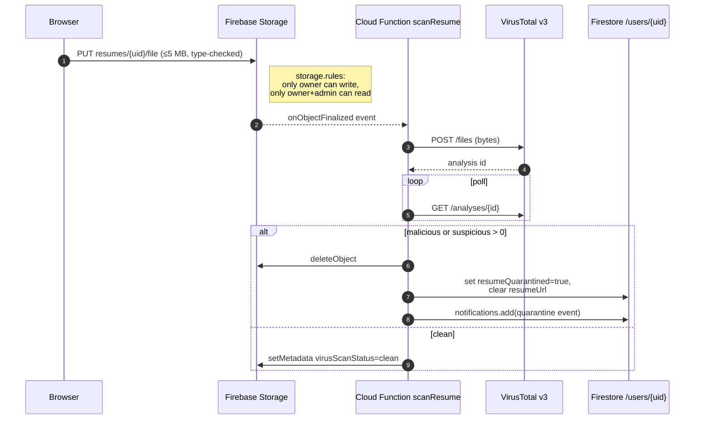
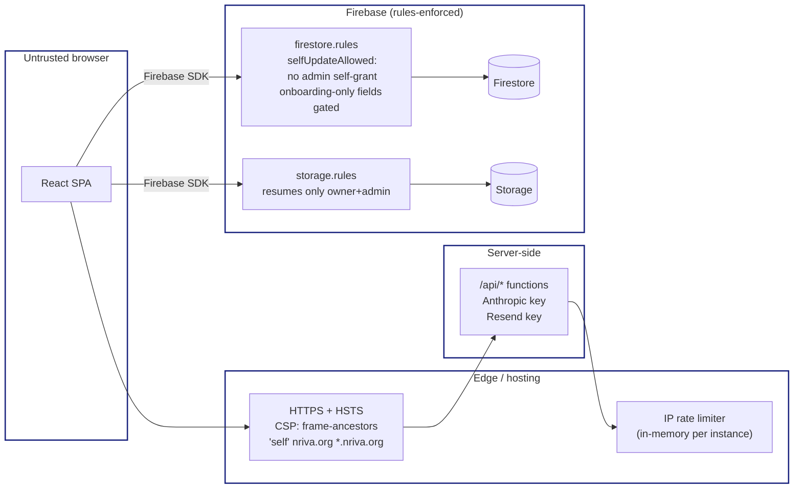

# NRIVA Internship Portal — Architecture

This document is a snapshot of the system as built. Diagrams are in Mermaid so they render on GitHub.

## 1. System context — who talks to what



## 2. Frontend — routes & shared building blocks



## 3. Authentication & onboarding flow



## 4. AI feature consent & call path

```mermaid
sequenceDiagram
  autonumber
  participant U as Browser
  participant SPA as React SPA
  participant FS as Firestore /users/{uid}
  participant API as /api/ai-assistant or /api/ai-generate
  participant CL as Anthropic Claude

  U->>SPA: invoke AI feature (chat / search / write-with-AI)
  SPA->>SPA: useAIConsent.ensureConsent()
  alt First time
    SPA-->>U: AIConsentModal disclosure
    U->>SPA: "I understand"
    SPA->>FS: updateUserProfile({aiConsent:{granted:true,…}})
  end
  SPA->>API: POST { message, role, context }
  Note over API: rate-limited;<br/>key only on server
  API->>CL: messages.create
  CL-->>API: response
  API-->>SPA: { reply }
  SPA-->>U: render
```

## 5. Application + offer state machine



## 6. Resume upload + virus scan



## 7. Audit log + admin alerting

```mermaid
sequenceDiagram
  autonumber
  participant Actor as Admin / user action
  participant SPA as React SPA
  participant FS as Firestore /activity
  participant API as /api/admin-alert
  participant Resend
  participant Email as Admin allowlist inbox

  Actor->>SPA: e.g. promote user to admin role
  SPA->>FS: updateUserRoles → addDoc(activity, {<br/>action:"roles_changed",<br/>expiresAt: now + 12 mo})
  Note right of FS: TTL policy on activity.expiresAt<br/>auto-deletes after 12 mo
  alt action ∈ ALERTABLE_ACTIONS
    SPA->>API: POST /admin-alert
    API->>Resend: send email
    Resend-->>Email: "[Alert] User roles changed"
    alt Resend not configured
      SPA->>FS: addDoc(notifications, {type:"admin_alert", expiresAt: now + 6 mo})
    end
  end
```

## 8. Trust boundaries & defenses



## 9. Data inventory at a glance

| Collection / store | Owner write | Reader scope | TTL |
|---|---|---|---|
| `users/{uid}` | self (limited fields) + admin | self + admin | none (manual delete via R11 flow) |
| `internships/{id}` | employer-of-record + admin | public read | none |
| `applications/{id}` | applicant + employer + admin | applicant + employer + admin | none |
| `messages/{id}` | sender + admin | sender + admin | none |
| `activity/{id}` | any auth user (append-only) | admin | 12 months (`expiresAt`) |
| `notifications/{id}` | any auth user (append-only) | admin | 6 months (`expiresAt`) |
| `public_stats/{id}` | any auth user | public read | none |
| `resumes/{uid}/…` (Storage) | self | self + admin | bound to user account |

## 10. External integrations summary

| Service | Direction | Data sent | Why |
|---|---|---|---|
| Anthropic Claude | server → Anthropic | user prompt + small profile slices (skills, grade, school, internship list) | AI assistant, AI search, Write-with-AI |
| Resend | server → Resend | admin email + alert/notification body | signup notifications, admin alerts |
| VirusTotal | Cloud Function → VT | resume bytes | malware scanning |
| Firebase Auth, Firestore, Storage, Functions | client/server → Firebase | account, profile, applications, files | core platform |
| Vercel / Azure SWA | hosting | static bundle, serverless logs | hosting |

## 11. Repo layout pointer

```
src/
  pages/{HomePage,LoginPage,RoleSelectPage,PrivacyPolicy,Terms}.jsx
  pages/intern/{Dashboard,Browse,Apply,Applications,Profile}.jsx
  pages/employer/{Dashboard,Postings,NewPosting,Applicants}.jsx
  pages/admin/{Dashboard,Internships,Applications,Users,Reports,Messages,Activity}.jsx
  components/{Layout,ProtectedRoute,AIAssistant,AIConsentModal,CookieNotice,ContactAdmin,Toast}.jsx
  hooks/{useAuth,useFirestore,useAIConsent}.js
  services/{firestore,ai}.js
  utils/{matching,date,status}.js
  contexts/AuthContext.jsx
  firebase.js  # SDK init + auth/storage helpers

api/
  ai-assistant.js, ai-generate.js, admin-alert.js
  notify-signup.js, public-stats.js, _rateLimit.js

functions/
  index.js, scanResume.js, package.json

firestore.rules     storage.rules     firebase.json
vercel.json         staticwebapp.config.json
.github/dependabot.yml
docs/{security-and-compliance,operations,e2e-test-plan,architecture,
     admin-roadmap,contributing,changelog}.md
```
